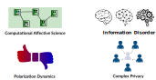
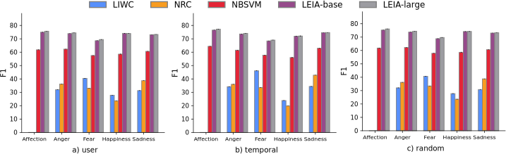

```{r xaringan-themer, include=FALSE, warning=FALSE}
#This block contains the theme configuration for the CSS lab slides style
library(xaringanthemer)
library(showtext)
style_mono_accent(
  base_color = "#5c5c5c",
  text_font_size = "1.5rem",
  header_font_google = google_font("Arial"),
  text_font_google   = google_font("Arial", "300", "300i"),
  code_font_google   = google_font("Fira Mono")
)
```

```{r setup, include=FALSE}
options(htmltools.dir.version = FALSE)
```


layout: true
<div class="my-footer"><span>David Garcia</span></div> 

---

background-image: url(figures/AboutUS.svg)
background-size: 98%

---

# Our Research Topics



---

background-image: url(figures/VennV2-1.svg)
background-size: 97%
---
background-image: url(figures/VennV2.svg)
background-size: 97%
---

layout: true
<div class="my-footer"><span>
<a href=https://arxiv.org/abs/2107.13236> Social media emotion macroscopes reflect emotional experiences in society at large. David Garcia, Max Pellert, Jana Lasser, Hannah Metzler. https://arxiv.org/abs/2107.13236 (2021)</a></span></div>

---

# Social Media Macroscopes of Emotions
</br>
## *1. Social Media Macroscopes of Emotions*
</br>
## 2. Detecting Individual Emotions in Social Media

---

# Social Media Macroscopes of Emotions

.pull-left[
```{r, echo=FALSE, out.width=1100}
knitr::include_graphics("figures/Macy.jpg")
```
<font size="5">
<a href="https://science.sciencemag.org/content/333/6051/1878/"> Diurnal and seasonal mood vary with work, sleep, and daylength across diverse cultures. Golder & Macy, Science (2011) </a>
</font>
]

.pull-right[
```{r, echo=FALSE, out.width=1100}
knitr::include_graphics("figures/hedonometer.png")
```

<font size="5">
<a href="https://journals.plos.org/plosone/article?id=10.1371/journal.pone.0026752"> Temporal patterns of happiness and information in a global social network: Hedonometrics and Twitter. Dodds et al. PLoS One (2011) </a>
</font>
]

---

background-image: url(figures/CollectiveEmotionsParis.svg)
background-size: 98%
---


## Limits of Social Media Data to Study Emotion

```{r, echo=FALSE, out.width=1100}
knitr::include_graphics("figures/Jaidka.png")
```

[Estimating geographic subjective well-being from Twitter: A comparison of dictionary and data-driven language methods. Jaidka et al. PNAS (2020)](https://www.pnas.org/content/117/19/10165.short)

---

# Validating a UK emotion macroscope

```{r, echo=FALSE, out.width=975, fig.align='center'}
knitr::include_graphics("figures/MacroTest2.svg")
```

---

# Sadness in Twitter and YouGov

```{r, echo=FALSE, out.width=1200, fig.align='center'}
knitr::include_graphics("figures/Sadness.svg")
```

- Similar results with dictionary-based and supervised methods (r~0.65)
---
# Anxiety in Twitter and YouGov

```{r, echo=FALSE, out.width=1200, fig.align='center'}
knitr::include_graphics("figures/Anxiety.svg")
```

- Improvement thanks to gender information in tweets

---
# Joy in Twitter and YouGov

```{r, echo=FALSE, out.width=1200, fig.align='center'}
knitr::include_graphics("figures/Joy.svg")
```

- Good correlation with supervised method but no correlation with dictionary-based method

---

layout: true
<div class="my-footer"><span>
<a href=https://www.nature.com/articles/s41598-022-14579-y>
Validating daily social media macroscopes of emotions. Max Pellert, Hannah Metzler, Michael Matzenberger, David Garcia. Scientific Reports (2022)</a></span></div>

---

## Reproducing with an Austrian daily macroscope

.pull-left[

- 20-day emotion survey in derstandard.at (N=268,128)
- Daily frequency, 3-day windows

- Text from Der Standard forum (N=452,013)

- Austrian tweets (N=515,187) filtered as UK macroscope

- Compared dictionary-based (LIWC) and supervised model (GS)

]
.pull-right[
```{r, echo=FALSE, out.width=900}
knitr::include_graphics("figures/DS1.svg")
```
]

---

## Online Media for Social Sensing of Emotions

```{r, echo=FALSE, out.width=850, fig.align='center'}
knitr::include_graphics("figures/socialsensing.svg")
```

---

## Detecting Individual Emotions in Social Media
</br>
## 1. Social Media Macroscopes of Emotions
</br>
## *2. Detecting Individual Emotions in Social Media*

---


layout: true
<div class="my-footer"><span><a href="https://epjdatascience.springeropen.com/articles/10.1140/epjds/s13688-023-00427-0"> LEIA: Linguistic Embeddings for the Identification of Affect. Segun Taofeek Aroyehun, Lukas Malik, Hannah Metzler, Nikolas Haimerl, Anna Di Natale, David Garcia. EPJ Data Science (2023)</a></span></div> 

---

## Challenges in individual emotion detection

**The problem with sentiment analysis: Writer versus reader emotions**

```{r, echo=FALSE, out.width=950, fig.align='center'}
knitr::include_graphics("figures/communication.png")
```

Current sentiment analysis approaches assume that the **ground truth** is an annotation of emotions by **a reader**, often a student or a crowdsourcing worker

---

### LEIA: Linguistic Embeddings for the Identification of Affect


---

# Datasets summary

- Vent dataset samples:


- Out-of-domain validation datasets:
<center>  </center>

---

# Results in Vent

<center>  </center>

LEIA outperforms supervised and unsupervised methods for all emotions and test datsets. $F_1$ values between 70 and 80.

---

# Out-of-domain results

.center[]

---

# Out-of-domain results

.center[
]
- LEIA is best or tied with the best in all out-of-domain tests
- LEIA is best or tied with the best in all emotions except Fear in TEC


---

# The Star Wars showdown

- LEIA vs VADER vs LIWC in sentiment classification
- Task: detect positive/negative sentiment
- Metric: AUC in Out-Of-Domain datasets

.center[
]


---

# Comparing with GPT models

.center[]

- Evaluation on a sample of 1000 texts per emotion label from the user test sample
- Both LEIA versions outperform GPT-3.5-turbo and GPT-4 in each emotion

---

# Comparing with GPT models

.center[]

- Evaluation on full OOD datasets (only test samples)
- Both GPT models outperform LEIA in GoEmotions, TEC, SemEval, and enISEAR
- LEIA en par with GPT for Universal Joy
- Model contamination? test samples for all these datasets are public and GPT models could have been trained with them
- Universal Joy is the newest dataset and might be younger than the cutoff date

---


# Error analysis with LIME

.center[]

Try it yourself:
https://huggingface.co/saroyehun/LEIA-large

---

# References

<a href=https://arxiv.org/abs/2107.13236> Social media emotion macroscopes reflect emotional experiences in society at large. David Garcia, Max Pellert, Jana Lasser, Hannah Metzler. (2021)

<a href=https://worldhappiness.report/ed/2022/using-social-media-data-to-capture-emotions-before-and-during-covid-19/> Using social media data to capture emotions before and during COVID-19. Hannah Metzler, Max Pellert, David Garcia. World Happiness Report (2022)

<a href=https://www.nature.com/articles/s41598-022-14579-y>
Validating daily social media macroscopes of emotions. Max Pellert, Hannah Metzler, Michael Matzenberger, David Garcia. Scientific Reports (2022)

<a href="https://epjdatascience.springeropen.com/articles/10.1140/epjds/s13688-023-00427-0"> LEIA: Linguistic Embeddings for the Identification of Affect. S. Aroyehun, L. Malik, H. Metzler, N. Haimerl, A. Di Natale, D. Garcia. EPJ Data Science (2023)</a>

.center[**More at: [www.dgarcia.eu](https://dgarcia.eu) and [@dgarcia_eu](https://twitter.com/dgarcia_eu)**  
**Thanks for listening!**]

